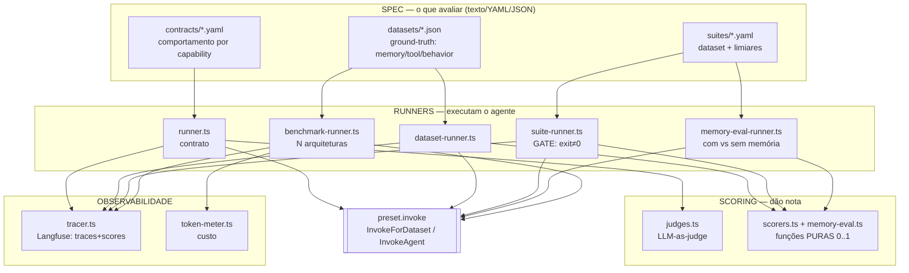
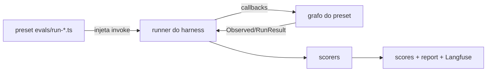

# Arquitetura do Harness

O harness é a infraestrutura que **executa e valida** o agente — não o agente em si.
Engloba: spec (contratos/datasets/suites) → runners → scoring → observabilidade.

## Visão geral



## Como o preset se liga (DI)

O harness **não importa** nenhum preset. Cada preset implementa `InvokeForDataset` /
`InvokeForBenchmark` / `InvokeMemoryEval` (em `presets/*/apps/api/evals/`) e injeta no runner.
Por isso o mesmo harness serve react, plan-execute, reflection.



## Os 5 modos

| Modo | Runner | Scoring | Saída |
|---|---|---|---|
| Contrato | `runner` | judges (LLM) | scores por case |
| Dataset | `dataset-runner` | scorers (puros) | scores objetivos |
| Suite | `suite-runner` | scorers + limiares | **gate** (exit≠0) + `resultados/*.json` |
| Memory-impact | `memory-eval-runner` | memory-eval (com vs sem) | decision_improvement etc |
| Benchmark | `benchmark-runner` | tokens/tempo/cobertura | `benchmarks/report.md` |

Regra: contrato/dataset/memory-impact **medem** · suite **decide** · benchmark **compara**.

## Estrutura de arquivos

```
packages/harness/src/
  contract.schema.ts    valida contrato YAML
  dataset.schema.ts     valida dataset JSON (3 tipos)
  suite.schema.ts       valida suite YAML
  runner.ts             contrato → judges
  dataset-runner.ts     dataset → scorers
  suite-runner.ts       suite → gate + resultados/
  memory-eval-runner.ts com vs sem memória
  benchmark-runner.ts   N arquiteturas → report
  scorers.ts            scoreMemory/Tool/Behavior (puros)
  memory-eval.ts        6 métricas de impacto (puras)
  judges.ts             LLM-as-judge
  tracer.ts             Langfuse
  token-meter.ts        custo
  evals/datasets|suites|resultados/   dados compartilhados pelos presets
```

Conceitos: [learning.md](./learning.md) §3. Como manipular: [skills/harness.md](../skills/harness.md).
Trocar de stack: [PORTING.md](../PORTING.md).
