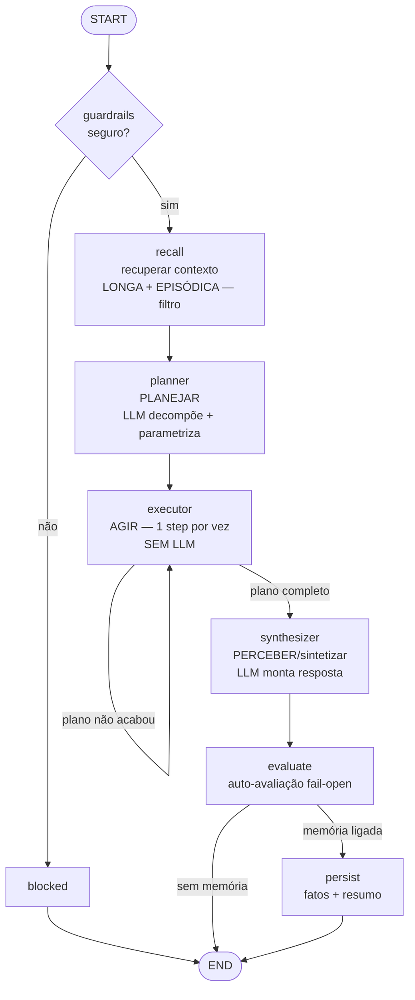

# Arquitetura — Plan-Execute

**Ideia:** planeja tudo primeiro (1 LLM call), executa os passos mecanicamente (sem LLM),
sintetiza no fim. Previsível e barato. Memória **enxuta** (só filtro: LONGA + EPISÓDICA).

## Grafo

## Fases do ciclo → nós

| Fase | Nó | Observação |
|---|---|---|
| recuperar contexto | `recall` | só filtro (sem CONTEXTUAL/semântica) |
| planejar | `planner` ✅ | a fase que define esta arquitetura |
| agir | `executor` (loop) | mecânico, sem LLM; paralelizável |
| perceber/sintetizar | `synthesizer` | monta a resposta dos resultados |
| avaliar | `evaluate` | fail-open |
| persistir | `persist` | fatos + resumo (sem reflexão evolutiva) |

## Quando usar
Fluxo sempre igual, steps independentes. **Quebra** se o resultado do step N muda o que
o step N+1 deve fazer → use `react`. **Teto:** `PLANNER_MAX_STEPS`.

## Evals deste preset

| Modo | Comando | Mede |
|---|---|---|
| Contrato | `npm run eval` | qualidade (LLM-judge) |
| Dataset | `npm run eval:datasets` | acerto objetivo (steps do plano vs tools esperadas) |
| Suite | `npm run eval:suite` | gate (passa/falha) |
| Memory-impact | `npm run eval:memory` | menos steps com memória (decision_improvement) |

Datasets/suites compartilhados em `packages/harness/evals/`. Memória enxuta → `eval:memory`
mede recall por filtro, não semântica. Detalhes em [docs/harness-architecture.md](../../docs/harness-architecture.md).
