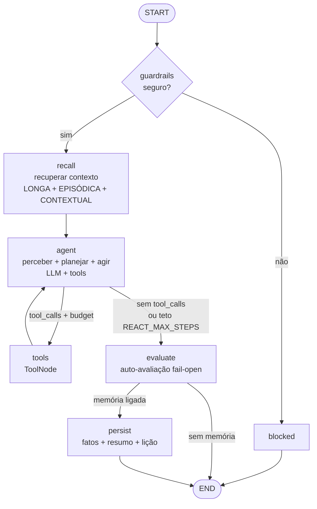
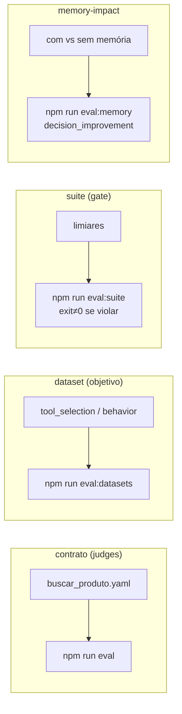

# Arquitetura — ReAct

**Ideia:** loop raciocínio↔ação. A cada passo o LLM decide chamar uma tool ou responder;
o resultado da tool volta pro LLM. Cobre o ciclo completo + memória + avaliação.

## Grafo

## Fases do ciclo → nós

| Fase | Nó | Observação |
|---|---|---|
| recuperar contexto | `recall` | filtro (LONGA/EPISÓDICA) + semântica (CONTEXTUAL) |
| perceber + planejar + agir | `agent` ⇄ `tools` | ReAct funde as 3 no loop |
| avaliar | `evaluate` | fail-open: registra score, nunca bloqueia |
| persistir | `persist` | extrai fato/resumo; lição se inesperado |

## Quando usar
Caminho aberto, ramificações, debugging. Resultado de um passo muda o próximo.
**Teto:** `REACT_MAX_STEPS` (guarda alucinação por contexto longo).

## Evals deste preset

| Modo | Comando | Mede |
|---|---|---|
| Contrato | `npm run eval` | qualidade (LLM-judge) |
| Dataset | `npm run eval:datasets` | acerto objetivo (tools/output) |
| Suite | `npm run eval:suite` | gate (passa/falha) |
| Memory-impact | `npm run eval:memory` | a memória ajudou? |

Datasets/suites compartilhados em `packages/harness/evals/`. Observabilidade: toda run
(`/chat` + evals) traça no Langfuse. Detalhes em [docs/harness-architecture.md](../../docs/harness-architecture.md).
