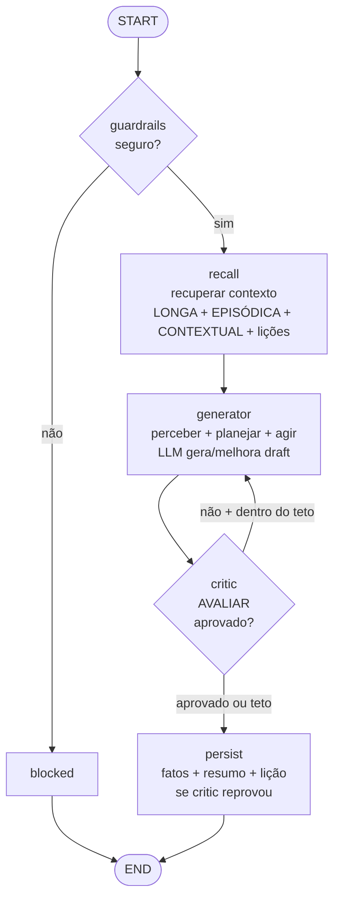

# Arquitetura — Reflection

**Ideia:** um gerador produz a resposta; um **critic** avalia antes de entregar. Loop até
aprovar ou bater o teto. O `critic` É a fase "avaliar" (não precisa de nó `evaluate`).
Memória **completa** + reflexão evolutiva (critic reprova → vira lição).

## Grafo

> Sem memória ligada, `critic` vai direto pro END (sem `persist`).

## Fases do ciclo → nós

| Fase | Nó | Observação |
|---|---|---|
| recuperar contexto | `recall` | completo + lições passadas no prompt |
| perceber/planejar/agir | `generator` | gera/melhora com base na crítica |
| **avaliar** | `critic` ✅ | a fase que define esta arquitetura |
| persistir | `persist` | lição se critic não aprovou até o teto |

## Self vs Cross reflection
`CRITIC_MODEL` = `GENERATOR_MODEL` → self (barato). `CRITIC_MODEL` = modelo maior → cross (melhor).

## Quando usar
Qualidade crítica, erro caro (código, jurídico, diagnóstico). **Quebra** se o critic é fraco
(só latência) ou critério de parada mal definido. **Teto:** `REFLECTION_MAX_ITER`.

## Evals deste preset

| Modo | Comando | Mede |
|---|---|---|
| Contrato | `npm run eval` | qualidade (LLM-judge) |
| Dataset | `npm run eval:datasets` | acerto objetivo (output; sem tools) |
| Suite | `npm run eval:suite` | gate (passa/falha) |
| Memory-impact | `npm run eval:memory` | menos iterações com memória (decision_improvement) |

`etapas` no memory-impact = iterações do critic loop. Datasets/suites compartilhados em
`packages/harness/evals/`. Detalhes em [docs/harness-architecture.md](../../docs/harness-architecture.md).
